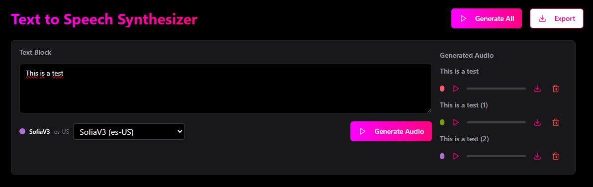

# Text-to-Speech Generator

This project was developed to generate audio tracks with different voices, based on a text script. The main goal was to learn how to use a TTS (Text-to-Speech) AI, specifically using IBM Watson TTS.

## How to Use

### Prerequisites
1. Create an IBM Cloud account.
2. Activate the Text-to-Speech service.
3. Obtain the API URL and API Key generated in IBM Cloud.
4. In the `text-to-speech.service.ts` file, insert the API URL in the `#apiUrl` field and the API Key in the `#apiKey` field.

### Features
- When pressing Enter in the text field, a new text block will be created, allowing you to generate a new TTS with a different voice.
- The list of generated audios will be displayed to the right of the text block, allowing you to listen to or download each generated audio.

### Interface
The interface consists of a text field where the user can type the script. Each text block can be configured with a different voice. To the right of the text block, the generated audios are listed and can be played or downloaded.

### How it Works
The TTS service makes a request to the IBM Watson API, passing the text to be synthesized and the selected voice. The generated audio is then made available to the user, who can interact with it by listening or downloading it.

## Contributing
1. Fork the repository to your GitHub account.
2. Clone your forked repository to your local machine.
3. Install the dependencies using `npm install`.
4. Make your changes and create a new branch.
5. Submit a pull request to the original repository.****
